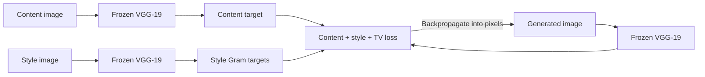

# Neural Canvas

Neural Canvas is a production-minded implementation of optimization-based neural style transfer. It separates the structure of a content image from the texture statistics of a style image, then optimizes a new image against both targets using a frozen VGG-19 feature extractor.

This is an independent PyTorch implementation of the method introduced by Gatys, Ecker, and Bethge. The repository is designed as a small, complete ML product rather than a notebook: it includes a reusable Python package, command-line interface, browser demo, tests, container setup, and CI.

| Content | Style | Generated result |
| --- | --- | --- |
|  |  |  |

The inputs above are generated by `examples/generate_demo_inputs.py`. The result was produced by this repository with the pretrained VGG-19 path at 256px for 180 optimization steps.

## What it demonstrates

- A clear implementation of content, style, Gram-matrix, and total-variation losses.
- Multi-layer feature extraction with a frozen ImageNet-pretrained VGG-19 network.
- Deterministic optimization with CPU, CUDA, and Apple Silicon device selection.
- User-facing controls for image size, optimization steps, style strength, and color preservation.
- Engineering around the model: validation, progress reporting, tests, packaging, Docker, and CI.

## How it works



The model weights never change. Only the pixels of the generated image are optimized.

## Quick start

Python 3.10 or newer is recommended.

```bash
python -m venv .venv
# Windows
.venv\Scripts\activate
# macOS/Linux
source .venv/bin/activate

python -m pip install -e ".[demo]"
```

Run the command-line interface:

```bash
nst content.jpg style.jpg --output output/stylized.png --steps 300 --size 512
```

Or launch the interactive demo:

```bash
python app.py
```

The first run downloads the official ImageNet-pretrained VGG-19 weights from PyTorch. CPU inference works, but a CUDA GPU is substantially faster for larger images.

## CLI options

```text
nst CONTENT STYLE
  --output PATH              Output image (default: output/stylized.png)
  --size INT                 Maximum content-image edge (default: 512)
  --steps INT                Optimization steps (default: 300)
  --style-weight FLOAT       Style-loss multiplier (default: 100000)
  --content-weight FLOAT     Content-loss multiplier (default: 1)
  --tv-weight FLOAT          Total-variation multiplier (default: 0.0001)
  --learning-rate FLOAT      Adam learning rate (default: 0.02)
  --initialization MODE      content or noise (default: content)
  --device DEVICE            auto, cpu, cuda, or mps (default: auto)
  --preserve-color           Keep the content image's chroma
```

## Development

```bash
python -m pip install -e ".[dev,demo]"
pytest
ruff check .
```

The test suite exercises the loss functions, configuration validation, image conversion, and the complete optimization loop with a tiny offline feature extractor. It does not download VGG weights.

## Project structure

```text
.
|-- app.py                         # Gradio interface
|-- src/neural_style_transfer/
|   |-- cli.py                     # Command-line entry point
|   |-- config.py                  # Validated run configuration
|   |-- engine.py                  # Optimization loop
|   |-- image_io.py                # Image conversion and color handling
|   |-- losses.py                  # Differentiable objectives
|   `-- model.py                   # VGG-19 feature extractor
|-- tests/                         # Fast, offline unit tests
|-- examples/                      # Reproducible inputs and a real model result
|-- docs/                          # Portfolio and migration notes
`-- Dockerfile
```

## Design choices

- **Normalized Gram matrices:** keeps style-loss magnitudes more stable across image sizes.
- **Non-inplace activations:** avoids autograd issues while optimizing the input tensor.
- **Content initialization by default:** converges faster and preserves composition better than pure noise for an interactive demo.
- **Total-variation regularization:** discourages isolated high-frequency artifacts.
- **Optional color preservation:** combines the generated luminance with the content image's chroma in YCbCr space.

## Limitations

This is the original iterative formulation, so each image pair requires optimization. It is intentionally different from feed-forward arbitrary style-transfer networks that trade some flexibility for real-time inference.

## Attribution

The implementation follows the ideas in:

- Leon A. Gatys, Alexander S. Ecker, and Matthias Bethge, [A Neural Algorithm of Artistic Style](https://arxiv.org/abs/1508.06576), 2015.
- Karen Simonyan and Andrew Zisserman, [Very Deep Convolutional Networks for Large-Scale Image Recognition](https://arxiv.org/abs/1409.1556), 2014.

The code in this repository is an original PyTorch implementation. It does not depend on the legacy course notebook or its utility files.

## License

MIT - see [LICENSE](LICENSE).
