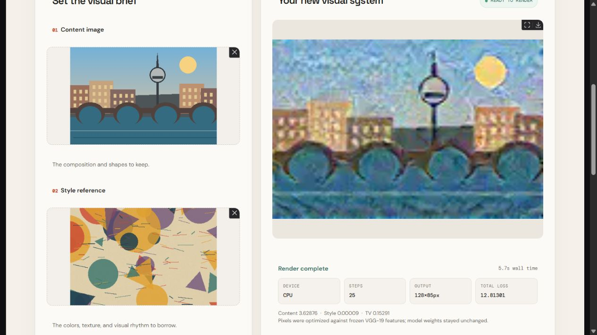
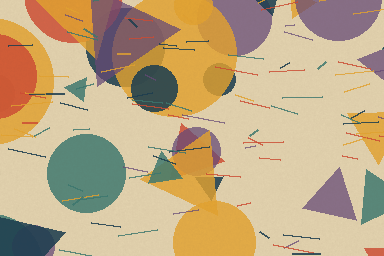
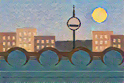
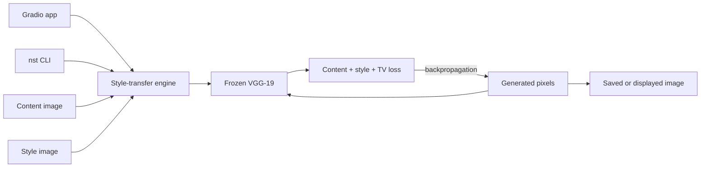

# Neural Canvas

[](https://github.com/Agneypraseed/neural-canvas/actions/workflows/ci.yml)

**Optimization-based neural style transfer**

Neural Canvas combines the spatial structure of a content image with the texture statistics of a style reference. It is an independent PyTorch implementation of the Gatys, Ecker, and Bethge method: ImageNet-pretrained VGG-19 stays frozen while Adam updates only the pixels of a generated image.

## Result



| Content input | Style reference | Generated result |
| --- | --- | --- |
|  |  |  |
| Generated by [`examples/generate_demo_inputs.py`](examples/generate_demo_inputs.py) | Generated by [`examples/generate_demo_inputs.py`](examples/generate_demo_inputs.py) | Pretrained VGG-19, 256 px, 180 optimization steps |

## Architecture



### Objective

For content image \(c\), style image \(s\), and generated image \(x\), a normalized Gram matrix captures channel correlations at VGG layer \(\ell\):

$$
G_\ell(z) = \frac{F_\ell(z)F_\ell(z)^\top}{C_\ell H_\ell W_\ell}
$$

Neural Canvas minimizes:

$$
\mathcal{L}(x) =
\alpha\,\operatorname{MSE}\!\left(F_{\text{relu4\_2}}(x),F_{\text{relu4\_2}}(c)\right)
+ \beta\!\sum_{\ell \in \mathcal{S}} w_\ell\,\operatorname{MSE}\!\left(G_\ell(x),G_\ell(s)\right)
+ \gamma\,\mathcal{L}_{TV}(x)
$$

where \(\mathcal{S}=\{\text{relu1\_1},\ldots,\text{relu5\_1}\}\). The content term preserves high-level structure, the style term matches correlations across five feature scales, and total variation discourages isolated high-frequency artifacts. Defaults are \(\alpha=1\), \(\beta=100{,}000\), and \(\gamma=0.0001\).

Key implementation decisions include non-inplace VGG ReLUs for safe input gradients, content initialization for quicker convergence, an optional noise initialization, and luminance/chroma recombination when `--preserve-color` is selected.

## Quick start

Python 3.10 or newer is required; CI tests Python 3.10, 3.11, and 3.12. From the repository root:

```bash
python -m venv .venv

# Windows PowerShell
.venv\Scripts\Activate.ps1

# macOS or Linux
source .venv/bin/activate

python -m pip install -e ".[dev,demo]"
```

The first real render downloads torchvision's official VGG-19 weights, approximately 548 MB, unless they are already in the PyTorch cache.

### Command line

```shell
nst examples/content.png examples/style.png --output output/stylized.png --size 256 --steps 180 --style-weight 100000 --device auto
```

Useful controls include `--initialization content|noise`, `--learning-rate`, `--content-weight`, `--style-weight`, `--tv-weight`, `--seed`, `--device auto|cpu|cuda|mps`, and `--preserve-color`. Run `nst --help` for the complete interface.

### Browser app

```bash
python app.py
```

Open `http://127.0.0.1:7860`. The public-facing UI limits image size and step count, serializes expensive renders, validates uploaded images, and reuses a feature extractor across requests.

## Verification

Install the development extras, then run:

```bash
python -m pytest
ruff check .
```

The suite covers the app, benchmark contract, CLI, configuration, optimization engine, image I/O, and losses. Tests use a tiny offline feature extractor where appropriate, so the suite does not need to download VGG-19 weights.

The checked-in [GitHub Actions workflow](.github/workflows/ci.yml) runs linting, tests, import and CLI/app smoke checks, wheel creation, and a Docker HTTP smoke test. No status badge is shown until the expected GitHub remote and workflow run are publicly verified.

### Docker

```bash
docker build --tag neural-canvas:local .
docker run --rm --publish 7860:7860 neural-canvas:local
```

The image runs Gradio as a non-root user on port `7860` and exposes a health check against Gradio's API-info endpoint.

## Reproducible benchmark

[`scripts/benchmark.py`](scripts/benchmark.py) exercises the actual pretrained VGG-19 pipeline and writes structured JSON to standard output:

```shell
mkdir output
python scripts/benchmark.py --content examples/content.png --style examples/style.png --size 128 --steps 25 --device cpu --seed 42 --output output/benchmark-128x25-cpu.png > output/benchmark-128x25-cpu.json
```

One verified reference run produced the following report values:

| Field | Recorded value |
| --- | ---: |
| VGG-19 weights | Cached before run |
| Image size / optimization steps | 128 px / 25 |
| Device | CPU |
| Render time | 4.6820562 s |
| End-to-end time | 6.6287567 s |
| Platform | Windows 11, AMD64 Family 23 Model 104 |
| CPU topology | 12 logical CPUs |
| PyTorch | 2.13, CPU build |

This is a single baseline measurement, not a cross-machine performance claim. End-to-end time includes input hashing, decode/resize, model construction, render, output encoding, and output hashing; the render field isolates the style-transfer call and device synchronization.

The JSON also records input and output SHA-256 hashes, preprocessed dimensions, full configuration, dependency versions, device resolution, timing semantics, and the final reported loss snapshot. Snapshot losses are re-evaluated after the reported Adam update and clamp, so they match the returned floating-point result tensor and callback image; the encoded file may include normal 8-bit quantization. Runs are seeded and reproducible within the same software and hardware environment. Exact pixel equality across CPU, CUDA, MPS, dependency versions, or devices is not promised.

## Deployment

| Target | Entry point | Runtime notes | Status |
| --- | --- | --- | --- |
| Local package | `nst` | CPU, CUDA, or MPS selected explicitly or automatically | Ready locally |
| Local web app | `python app.py` | Gradio on port 7860 | Ready locally |
| Docker | `Dockerfile` | Python 3.11 slim image, non-root runtime, health check | Configured |
| Hugging Face Spaces | Root README metadata + `app.py` | Gradio 6.22.0, Python 3.12.12, optional ZeroGPU decorator | Pending deployment |

The Spaces path loads and places the frozen extractor at module startup as required by ZeroGPU, requests a 60-second allocation for each decorated render, and falls back to lazy local loading when the `spaces` package is absent. The public app caps work at 128-256 px and 25-100 steps, queues at most eight jobs, and processes one render at a time. ZeroGPU user quotas, capacity, cold starts, and Space sleep can still delay or prevent a render; these are hosting constraints rather than guarantees made by this repository.

## Technology stack

| Layer | Tools |
| --- | --- |
| Model and optimization | PyTorch, torchvision, pretrained VGG-19, Adam |
| Images | Pillow, NumPy |
| Interfaces | Gradio, `argparse`, setuptools console scripts |
| Quality | pytest, Ruff, GitHub Actions |
| Packaging and delivery | `pyproject.toml`, Docker, Hugging Face Spaces metadata |

## Repository map

```text
.
├── app.py                              # Gradio interface and public-run guards
├── scripts/benchmark.py                # Machine-readable real-model benchmark
├── src/neural_style_transfer/
│   ├── cli.py                          # nst command
│   ├── config.py                       # Validated hyperparameters
│   ├── engine.py                       # Pixel-optimization loop
│   ├── image_io.py                     # Loading, validation, saving, color handling
│   ├── losses.py                       # Content, Gram-style, and TV objectives
│   └── model.py                        # Frozen VGG-19 feature extractor
├── tests/                              # Offline-friendly automated tests
├── examples/                           # Reproducible inputs and real model output
├── docs/                               # Deployment, interview, résumé, and app screenshot
├── .github/workflows/ci.yml            # Multi-version and container CI
├── Dockerfile
└── pyproject.toml
```

## Attribution

Neural Canvas implements the method introduced in:

- Leon A. Gatys, Alexander S. Ecker, and Matthias Bethge, [A Neural Algorithm of Artistic Style](https://arxiv.org/abs/1508.06576), 2015.
- Karen Simonyan and Andrew Zisserman, [Very Deep Convolutional Networks for Large-Scale Image Recognition](https://arxiv.org/abs/1409.1556), 2014.

The algorithm and VGG architecture belong to their respective authors. The package, engine, CLI, application, tests, benchmark, and deployment setup in this repository are an original PyTorch implementation; they do not reuse a legacy course notebook or its helper utilities.

## License

Released under the MIT License. See [LICENSE](LICENSE).
