# Deploying Neural Canvas

Neural Canvas is configured for a public Hugging Face Gradio Space on ZeroGPU. The
deployment path is intentionally free-only: the workflow synchronizes code, but it cannot
select or upgrade hardware, add billing credits, or fall back to a paid accelerator.

This guide reflects the official platform documentation checked on **2026-08-13**. Hugging
Face eligibility, quotas, and supported versions can change, so recheck the linked sources
before creating or materially changing the Space.

## Deployment status

The repository contains the runtime pins and deployment workflow. That is not evidence that a
Space exists or that the public application works. Do not publish a live-demo URL until the
[live verification checklist](#live-verification-checklist) has passed on the real Space.

## Architecture

```mermaid
flowchart LR
    A["Push to GitHub main"] --> B["CI: lint, tests, package, container smoke"]
    B -->|successful push run| C["Deploy Space workflow"]
    C --> D["Official huggingface/hub-sync action"]
    D --> E["Public Gradio Space repository"]
    E --> F["Space build: Python and pinned dependencies"]
    F --> G["Gradio app on ZeroGPU"]
    G --> H["GPU allocated only for the decorated render callback"]
```



The GitHub repository is the source of truth. The Space repository is a deployment mirror, not
a second place to edit the project. The application remains usable outside Hugging Face because
`app.py` treats the platform-only `spaces` import as optional.

### Runtime contract

| Component | Deployment value | Where it is controlled |
| --- | --- | --- |
| Space SDK | Gradio | Root `README.md` YAML metadata |
| Gradio | `6.22.0` | `sdk_version` in the root `README.md` |
| Python | `3.12.12` | `python_version` in the root `README.md` |
| Entry point | `app.py` | `app_file` in the root `README.md` |
| PyTorch | `2.11.0` | `requirements.txt` |
| Torchvision | `0.26.0` | `requirements.txt` |
| Project package | Editable install of the repository | `-e .` in `requirements.txt` |
| ZeroGPU adapter | Platform-provided `spaces` package | Hugging Face runtime; deliberately not in requirements |

The exact PyTorch/Torchvision pairing follows the [official PyTorch compatibility
instructions](https://pytorch.org/get-started/previous-versions/#v2110). The broader dependency
ranges in `pyproject.toml` remain appropriate for normal local/package use; the exact
`requirements.txt` pins define only the hosted Space environment. Gradio is installed by the
Space SDK metadata, not duplicated in `requirements.txt`.

The root README must begin with a valid Space metadata block. The deployment-relevant fields are:

```yaml
---
sdk: gradio
sdk_version: 6.22.0
python_version: 3.12.12
app_file: app.py
---
```

Other card fields such as title, emoji, colors, tags, and description may be present in the same
block. See the [Space configuration reference](https://huggingface.co/docs/hub/spaces-config-reference).

## Free-only constraints

[ZeroGPU](https://huggingface.co/docs/hub/spaces-zerogpu) currently has these relevant rules:

- It supports the Gradio SDK only, Gradio 4 or newer, Python `3.12.12` or `3.10.13`, and the
  documented PyTorch releases `2.8.0`, `2.9.1`, `2.10.0`, and `2.11.0`.
- A free personal account may host at most two ZeroGPU Spaces only when the email is verified,
  the account is older than 30 days, and the account is in good standing.
- A logged-in free user currently receives five minutes of daily ZeroGPU use; an unauthenticated
  visitor receives two minutes. The allowance resets 24 hours after that user's first GPU use,
  and remaining allowance affects queue priority.
- ZeroGPU is shared infrastructure. Queueing, cold starts, and quota exhaustion are expected and
  there is no dedicated-capacity guarantee.

This project requests the default ZeroGPU size and wraps one render at a time. The current app
limits the queue to eight jobs, caps the public GPU callback at 60 seconds, and gives a queued job
one render slot. Change those numbers only after measuring the actual hosted workload; shorter
honest duration requests receive better queue priority.

**Cost guardrail:** do not select CPU Upgrade, a named paid GPU, additional replicas, paid
storage, PRO, or prepaid credits for this deployment. The workflow never changes hardware. If
the account does not offer the free ZeroGPU option, leave deployment disabled and treat account
eligibility as a blocker. Do not silently substitute billable hardware. Under the current
[Spaces creation rules](https://huggingface.co/docs/hub/spaces-overview), a new compute-backed
Gradio Space on a free personal account is available only through the ZeroGPU exception.

## One-time Space setup

Hardware choice and credentials require an account owner and must be completed in the web UIs.
Never paste a token into an issue, commit, terminal transcript, URL, or chat.

### 1. Confirm free ZeroGPU eligibility

1. Sign in to Hugging Face and verify the account email.
2. Confirm the account is more than 30 days old and currently hosts fewer than two ZeroGPU
   Spaces.
3. Open [Create a new Space](https://huggingface.co/new-space).
4. Choose the intended personal account as owner, a stable slug, **Public** visibility, and the
   **Gradio** SDK.
5. Select **ZeroGPU** as the hardware during creation or immediately under **Space > Settings >
   Hardware**. Do not choose a paid hardware flavor and do not add a payment method for this
   project.

If ZeroGPU is absent or the UI asks for a paid plan, stop. Recheck email/account-age eligibility
and the official ZeroGPU limits rather than accepting an upgrade.

The durable Space page will be:

```text
https://huggingface.co/spaces/<owner>/<space-slug>
```

The running application also receives a permanent `https://<space-subdomain>.hf.space` URL.
Copy the exact subdomain from the Space's **Embed this Space** dialog; do not infer it from the
repository slug. These URLs remain stable across rebuilds, sleeps, and restarts, although the
app may need time to wake.

### 2. Create a least-privilege Hugging Face token

1. Open [Hugging Face Settings > Access Tokens](https://huggingface.co/settings/tokens).
2. Choose **Create new token**, select **Fine-grained**, and give it a deployment-specific name.
3. Grant write access to only the newly created target Space repository. Do not grant account-wide
   write access when a repository-scoped permission is available.
4. Copy the token once into GitHub as described below. Do not store it in the Space itself.

Hugging Face recommends one fine-grained token per production integration; see the official
[token guidance](https://huggingface.co/docs/hub/security-tokens).

### 3. Configure GitHub Actions

In the GitHub repository, open **Settings > Secrets and variables > Actions**.

On the **Secrets** tab, choose **New repository secret**:

| Name | Value |
| --- | --- |
| `HF_TOKEN` | The fine-grained token with write access to only the target Space |

On the **Variables** tab, choose **New repository variable**:

| Name | Value |
| --- | --- |
| `HF_SPACE_ID` | `<owner>/<space-slug>` without a URL, protocol, or trailing slash |

`HF_SPACE_ID` is an identifier and is not sensitive. `HF_TOKEN` is a credential and must remain a
secret. If the variable is absent or empty, the deploy job safely skips. If the variable exists
but the secret is absent, invalid, or expired, the sync step fails without deploying.

### 4. Perform the first sync

1. Ensure the Space already exists and is set to Public + Gradio + ZeroGPU.
2. Push a verified change to `main`; deployment starts only after the `CI` workflow succeeds.
   Alternatively, open **Actions > Deploy Hugging Face Space > Run workflow**. Manual runs also
   deploy the current `main`, not an arbitrary feature branch.
3. Open the workflow run and confirm the official sync action completes.
4. Open the Space and wait for its separate build to reach **Running**.

The workflow uses the official [`huggingface/hub-sync@v0.1.0`](https://github.com/huggingface/hub-sync/tree/v0.1.0)
action. It mirrors the checked-out repository through the Hub API, automatically excludes `.git/`
and `.github/`, and deletes Space files that no longer exist in GitHub. Therefore, do not make
durable code edits directly in the Space: a later sync will overwrite or remove them.

## Local reproduction

Use an isolated Python 3.12 environment. The following reproduces the hosted package, framework,
and SDK versions without installing the platform-only `spaces` package:

```bash
python --version
python -m pip install --upgrade pip
python -m pip install -r requirements.txt "gradio==6.22.0"
python -c "import gradio, torch, torchvision; print(gradio.__version__, torch.__version__, torchvision.__version__)"
python app.py
```

Open `http://127.0.0.1:7860`. Outside ZeroGPU, the no-op decorator preserves the application's
normal CPU/CUDA/MPS device selection. For routine development rather than exact Space parity,
install `.[demo,dev]` as documented in the project README.

The first real render needs network access to download the official ImageNet VGG-19 checkpoint.
Tests use an offline tiny extractor and do not validate that download.

## CI/CD behavior

The workflows deliberately separate verification from publication:

1. `.github/workflows/ci.yml` runs on a push or pull request.
2. `.github/workflows/deploy-space.yml` listens for a completed workflow named `CI`.
3. The deploy job accepts only a successful **push** run whose head branch is `main`; a successful
   pull-request run cannot publish unmerged code.
4. The job checks out the exact commit SHA that CI verified and mirrors it to the target Space.
5. Hugging Face detects the new Space revision, builds it, and restarts the application.

A manual dispatch is an escape hatch for the current `main`, for example after adding credentials
or recovering from a transient Hub outage. It does not run or require CI itself, so first confirm
that the current `main` commit has a successful CI run.

The GitHub workflow verifies only that synchronization succeeded. It does **not** wait for the
Hugging Face build, inspect Space logs, open the public page, or run an end-to-end render. Those
checks remain mandatory before advertising the deployment.

## Cold starts and model weights

Torchvision's `VGG19_Weights.DEFAULT` checkpoint is approximately 548.1 MB according to the
[official VGG-19 weights documentation](https://docs.pytorch.org/vision/main/models/generated/torchvision.models.vgg19).
Local execution loads it lazily on the first render and caches one extractor per device. The
ZeroGPU deployment instead constructs one CUDA extractor during module startup, as required by
the hosted runtime.

The free Space filesystem is ephemeral. A fresh build, restart, or replacement container may
lose the Torch cache and download the checkpoint again. As a result:

- Space startup downloads and constructs VGG-19 at module scope, then registers its CUDA
  placement with ZeroGPU's emulation layer before the app becomes ready;
- the page does not become ready until that startup work finishes, so a cold build or restart can
  take substantially longer than a warm one;
- renders in the same process reuse that startup extractor; and
- a network or upstream download failure leaves the UI importable but makes render requests show
  a VGG-19 initialization error until the Space restarts successfully.

This module-scope placement follows the current ZeroGPU guidance; lazy model placement inside the
decorated callback is deliberately avoided because it transfers weights less efficiently and
charges cold initialization against the user's GPU allocation.

Do not commit the checkpoint or a Torch cache to Git. Do not claim a cold-start runtime until it
has been observed on the public Space. Record cold and warm timings separately because they
measure different things.

## Live verification checklist

Complete this after every first deployment or material runtime change. Record the Space revision,
date, hardware badge, cold/warm state, settings, and observed wall time.

- [ ] The Hugging Face build completes and the runtime stage is **Running**, with no unresolved
  build or startup error in the logs.
- [ ] The hardware badge/settings show **ZeroGPU**, not CPU Basic or a paid accelerator.
- [ ] Both the permanent Space page and exact `.hf.space` URL load while signed out in a private
  browser window; the UI is visible rather than blank.
- [ ] The built-in `examples/content.png` and `examples/style.png` load in the real UI.
- [ ] One low-cost render completes using the public defaults; record image size, steps, device,
  queue delay, render wall time, and whether the VGG checkpoint was cold or warm.
- [ ] Progress advances through validation, VGG loading, and pixel optimization.
- [ ] The result image and run metadata appear, including device, steps, output size, elapsed time,
  total loss, and component losses.
- [ ] The output's download button produces a valid image, and fullscreen viewing works.
- [ ] **Reset** clears both inputs, the output, and the run summary.
- [ ] Submitting with a missing input shows the intended validation error without exposing a
  traceback; at least one invalid/oversized upload is also rejected cleanly.
- [ ] A second warm render completes and reuses the process-level feature extractor.
- [ ] After a restart or genuine sleep/wake cycle, the page returns and the cold-start behavior is
  understood from logs.

Only after all applicable checks pass should the exact live URL and observed benchmark be added
to public project/resume material.

## Troubleshooting

### Deploy job is skipped

Confirm `HF_SPACE_ID` exists under GitHub **Actions variables** and is exactly
`<owner>/<space-slug>`. A missing variable intentionally skips the job. Also confirm that the
triggering `CI` run came from a push to `main`, not only a pull request. If the job runs but the
sync step fails, confirm `HF_TOKEN` exists under **Actions secrets**.

### Authentication fails with 401 or 403

Confirm `HF_TOKEN` is an Actions **secret**, has not expired or been revoked, is authorized for the
target owner, and has write access to that one Space. Confirm the variable points to the same
repository. Rotate a suspected token in Hugging Face and replace the GitHub secret; never print it
for diagnosis.

### Space uses the wrong SDK, Python, or Gradio version

Inspect the YAML block at the very top of the mirrored root README. Confirm `sdk: gradio`,
`sdk_version: 6.22.0`, `python_version: 3.12.12`, and `app_file: app.py`, then rebuild. Metadata
must start at the beginning of the file and use valid YAML.

### Build reports a Torch/Torchvision incompatibility

Confirm the Space received the root `requirements.txt` and that it contains the exact official
pair `torch==2.11.0` and `torchvision==0.26.0`. Check the build log for a later dependency that
overrode either version. Reproduce from a clean Python 3.12 environment before changing pins.

### `spaces` is missing or the render never receives CUDA

Do not add `spaces` to `requirements.txt`; ZeroGPU provides it. Confirm the Space uses the Gradio
SDK and that **Settings > Hardware** shows ZeroGPU. On a normal local machine, the optional import
and no-op fallback are expected.

### VGG-19 initialization fails

Inspect runtime logs for the checkpoint URL, DNS/TLS errors, disk exhaustion, or an interrupted
download. Restart once and retry after the platform/network recovers. A restart may require the
full 548.1 MB download again because the cache is ephemeral. Never solve this by committing a
`.pth` checkpoint.

### Jobs time out or remain queued

Distinguish queue delay, exhausted visitor quota, cold checkpoint download, and actual GPU render
time. Re-run the benchmark with the public default size and steps. Reduce public work only when
measurements justify it; increase the `@spaces.GPU` duration only when a reproducible hosted run
shows that the honest maximum exceeds 60 seconds. Do not switch to paid hardware.

### A file disappeared from the Space

The deployment action mirrors deletions by design. Restore the file in GitHub if it belongs in the
deployment, verify it there, and let the next successful `main` CI run resync it. Avoid direct
Space-only edits.

## Rollback

Rollback through GitHub so source and deployment history remain aligned:

1. Identify the last known-good GitHub commit and the first bad commit.
2. Revert the bad change with a new commit; do not reset, force-push, or rewrite `main`.
3. Let CI verify the revert. A successful push run automatically mirrors the exact revert commit.
4. Wait for the Space build to reach **Running**, then repeat the live verification checklist.
5. If the current app is unsafe while the revert is being prepared, pause the Space from its
   Settings page. Resume it only after the corrected revision is deployed.

If the problem is platform-wide rather than code-related, leave the known-good revision in place
and retry later. A rollback is not evidence of successful recovery until the public app and a real
low-cost render have both been verified.

## Official references

- [Hugging Face Spaces overview](https://huggingface.co/docs/hub/spaces-overview)
- [ZeroGPU eligibility, versions, quotas, and duration behavior](https://huggingface.co/docs/hub/spaces-zerogpu)
- [Space README configuration reference](https://huggingface.co/docs/hub/spaces-config-reference)
- [Official GitHub Actions integration](https://huggingface.co/docs/hub/repositories-github-actions)
- [Hugging Face access-token guidance](https://huggingface.co/docs/hub/security-tokens)
- [PyTorch 2.11.0 / Torchvision 0.26.0 pairing](https://pytorch.org/get-started/previous-versions/#v2110)
- [Torchvision VGG-19 weights](https://docs.pytorch.org/vision/main/models/generated/torchvision.models.vgg19)
